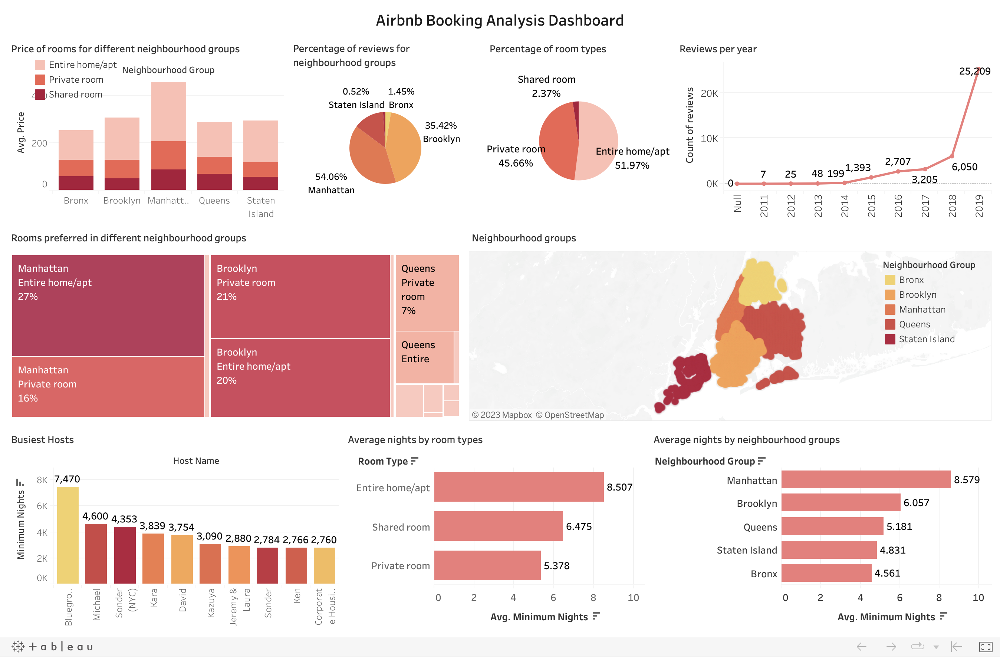

<h1 align="center"> Airbnb Booking Analysis </h1>

 
  

In this project, I have attempted to analyze the Airbnb booking dataset and come up with some relevant conclusions about the factors contributing to many bookings. No personal information of customers is provided in this dataset. Also built an interactive dashboard in Tableau to visually represent the results of the my EDA project. 

## :book: Problem Statement

The dataset has around 49,000 observations, with 16 columns containing both categorical and numeric values. Every year millions of visitors come to New York for its museums, entertainment, restaurants and commerce.
The task is to analyze the dataset provided by Airbnb for New York City to draw out some useful insights that will help them to improve their user experience.

Data analysis is performed to answer the following questions:
<li>What can we learn about different hosts and areas?</li>
<li>What is the availability of room types for different neighbourhood groups?</li>
<li>What is the minimum number of nights people stay in different places?</li>
<li>What is the average price for different neighbourhood groups?</li>
<li>What is the relationship between price and the number of reviews?</li>
<li>Which neighbourhood group has got the most reviews?</li>
<li>Which hosts are the busiest and why?</li>
<li>Is there any noticeable difference in traffic among different areas?</li>

## :book: Approach

1.	Understanding the business task.
2.	Import relevant libraries and define useful functions.
3.	Reading data from files given.
4.	Data inspection.
5.  Data cleaning.
6.	Exploratory data analysis, to find which factors affect the bookings and how they affect them.
7.	Draw conclusions from the analysis.
8.	Build an interactive dashboard.

## :book: Exploratory Data Analysis

EDA was carried out in 3 steps:

### 📊 Univariate Analysis
Uni means one and variate means variable, so in univariate analysis, there is only one dependable variable. The objective of univariate analysis is to derive the data, define and summarize it, and analyze the pattern present in it. In a dataset, it explores each variable separately.
Univariate analyses were done on:
<li>Percentage of bookings for each room type</li>
<li>Airbnb listings in different neighbourhood groups</li>
<li>Distribution of room types</li>
<li>Distribution of various neighbourhood groups</li>
<li>Number of bookings made for each room type</li>
<li>Percentage of reviews for different neighbourhood groups</li>

### 📊 Bivariate Analysis
Bi means two and variate means variable, so here there are two variables. The analysis is related to cause and the relationship between the two variables.
Bivariate analyses were done on:
<li>Number of nights stayed by people at different locations</li>
<li>Number of nights stayed by people for each room type</li>
<li>Count of reviews per year</li>
<li>Average price of listings for different neighbourhood groups</li>
<li>Average price for different types of room</li>
<li>Top 5 hosts with maximum number of bookings</li>

### 📊 Multivariate Analysis
Multi means multiple and variate means variable, so here there are more than two variables. It aims to identify patterns between multiple variables. 
Multivariate analyses were done on:
<li>Availability of different rooms for different neighbourhood groups</li>
<li>Price of different room types in different neighbourhood groups</li>
<li>Room types preferred by people in different neighbourhood groups</li>

### 📊 Correlation Analysis
It is used to measure the strength of the linear relationship between two variables and compute their association. Correlation analysis calculates the level of change in one variable due to the change in the other. From the correlation heatmap we got to know that the columns 'review_per_month' and 'number_of_review' have strong correlation other than that there were not many strong correlations among varibales.

### 📊 Data Visualization

An interactive dashboard was also created with Tableau to display charts associated with the analysis.

Click [here](https://public.tableau.com/app/profile/akshit.singh2395/viz/AirbnbBookingAnalysisDashboard/Dashboard1?publish=yes) to interact with the data visualization.

## 📘: Conclusion

The following conclusions were drawn from the analysis:
<li>People stay more nights in Manhattan in comparison to other places though it is one of the most expensive places to live.</li>
<li>Although the average price in Manhattan is the highest, people prefer to stay in those rooms whose price is low.</li>
<li>Among the 3 room types entire homes/apartments are in high demand.</li>
<li>People who like to stay in the entire home or apartment tend to stay longer.</li>
<li>Manhattan has the most number of listings followed by Brooklyn. Staten Island has the least number of listings.</li>
<li>Staten Island has the highest availability of rooms to other places.</li>
<li>In Staten Island, people stay for less number of nights which shows travellers visit this place.</li>
<li>New guests tend to cancel bookings more than repeated customers.</li>
<li>Visits planned with longer stays are booked earlier than those planned with shorter stays.</li>

## :scroll: Credits
Akshit Singh | Engineer | Machine Learning Enthusiast

